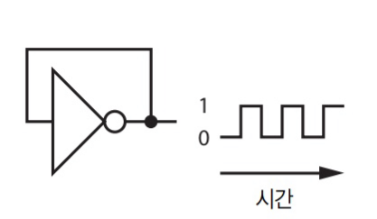

# 메모리와 디스크의 핵심: 순차 논리

- 하드웨어 많은 부분을 생략
- 컴퓨터는 비트를 어떻게 기억하는가?

## 시간 표현과 상태 기억

- 시간 : 주기 함수를 이용하여 측정
  - 지구의 자전, 진자 운동 ...

### 발진자

- 이런 연결을 되먹임(feedback)이라고 함
  - 출력이 다시 입력으로 들어가는 형태
  - 출력이 0과 1 사이를 진동
  - 진동 속도는 전파 지연에 따라 결정됨
    - 온도에 따라 약간 달라짐

- 정확하고 싼 발진자를 만들기 위해 결정 사용
  - 압전효과 이용
    - 결정에 전기를 가하면 결정이 구부러짐
  - 음성 진동 잡는데도 사용

- 발진자를 이용하여 컴퓨터에 clock 제공

### 래치 & 플립플롭

- [디지털논리회로][디지털논리회로]의 플립플롭 참고

- edge : 논리 값이 특정 값에 머무는 동안은 데이터를 잡지 않고, 바뀌는 중간에 데이터를 잡는 것
  - edge에 의해 데이터 변화가 촉발되는 래치 = 플립플롭
- 정보를 1비트 기억할 방법
  - 출력이 유지됨

### 레지스터

- 클록(발진자를 이용해 만든 clock)을 공유하는 D 플립플롭을 한 패키지에 넣은 것
- 쉽게 여러 비트를 저장 가능

## 메모리 조직과 주소 지정

- 메모리 
  - n개의 레지스터
  - 실렉터(특정 주소<특정 레지스터>의 값을 출력하는데 쓰임)
  - [디코더][디코더] 
    - N 비트의 이진 코드를 풀어내는 역할
  
- 버스
  - 비트를 이동시키는 대량 교통 수단
  - 메모리 칩에는 **주소 버스(address bus)**,**데이터 버스(data bus)**가 존재

### 임의 접근 메모리

- RAM(random access memory)
- 휘발성 메모리(전원이 꺼지면 데이터가 사라짐)
  - SRAM(static RAM)
    - 각 비트에 6개의 트랜지스터
    - 가격이 비싸지만 빠름
    - 트랜지스터 자체가 공간을 차지하기에 많은 비트를 저장하기에 좋진 않음
  - DRAM(dynamic RAM)
    - capacitor에 전자를 담고 트랜지스터 1개를 이용해 뚜껑을 닫는 형식
    - 주기적으로 전자를 다시 채워야 해서 갱신 해야 함
    - 집적도가 높아 큰 메모리 칩에 사용

- 비휘발성 메모리
  - core 메모리(아주 오래된 기술)
    - 도넛 모양 메모리
    - 자화(자성을 띄게 된)된 방향으로 0과 1 구분
    - 가로 세로선의 격자에 코어 배열
    - 코어의 변화를 감지하기 위한 감지선 필요

#### 읽기 전용 메모리

- ROM(read-only memory)
- 정확히는 한 번만 쓸(write) 수 있는 메모리
- 초창기 ROM은 종이에 구멍을 뚫어 기록하고, 이를 읽는 형태

##### 변화 과정

1. mask-programmable ROM : 마스크를 이용하여 비트 패턴 제작 
   - 마스크 가격이 너무 비쌈
2. PROM(Programmable ROM): 단 한번 프로그램을 적을 수 있는 ROM
   - 칩에 있는 Ni-Cr 퓨즈를 녹이는 방식
   - 일회용이라 너무 많이 버려짐
3. EPROM(erasable programmable ROM)
   - 지울 수 있는 읽기 전용 메모리
   - 특정 자외선 빛을 EPROM의 수정창에 조사하면 내용을 지울 수 있는 형태
4. EEPROM(electrically EPROM)
   - 전기로 지울 수 있는 EPROM
   - 지우는 과정이 느림
   - 기술적으로는 RAM과 동일, 데이터를 쓰는 데 시간이 오래 걸리고 RAM보다 비쌈.. => RAM으로 대체

## 블록 장치(디스크 드라이브...)

- 자화된 판(디스크 내부의 동그란 판)에 비트를 저장 하는 형식
- 디스크 헤드를 이용하여 원하는 비트를 가져옴
- 다른 메모리에 비해 상대적으로 느림
  - 방금 지나간 지역의 데이터가 필요한 경우 판을 한바퀴 돌려야함(회전 지연 시간 21년 기준 8ms)
- 기계 부품이 시간이 지나면서 낡아 오류가 발생
- 기록 밀도와 속도를 맞바꾼 기억 장치
  - 주소나 데이터 연결을 위한 공간이 필요X
  - 블록(섹터) 단위로 주소를 지정해 읽음
- 성능 수치
  - 탐색시간(seek time) : 헤드를 한 트랙에서 다른 트랙으로 옮기는데 걸리는 시간
  - 회전 지연 시간(rotational latency) : 원하는 데이터가 헤드 아래로 올 때 까지 걸리는 시간

- 그외
  - 플로피 디스크
    - 저렴하고 탈착 가능
    - 잘 구부러지는 재질이라 기존의 디스크를 하드 디스크라고 부르기 시작
  - 자기 드럼
    - 회전하는 원통에 헤드가 줄지어 있는 저장장치
  - 자기 테이프
    - 자화시킨 테이프를 감은 릴을 사용하는 저장장치
    - 디스크드라이브 보다 느림
  - 광학 디스크
    - 데이터를 읽고 쓸 때 자성 대신 빛 사용
    - CD, DVD
    - 대량 생산에 장점

## 플래시 메모리와 SSD

### 플래시 메모리

- EEPROM 종류
- 음악 플레이어, 디지털 카메라 등 응용에 적합
- DRAM과 비슷한 형식
  - 갱신이 필요 없음
  - 여러번 읽고 쓸 경우 마모
- 빈 플래시 메모리에 데이터 기록을 위해서는 먼저 비트를 0으로 채워야 함
  - 0을 1로 바꿀수는 있지만, 특정 비트만 다시 0으로 되돌릴 수 없음
  - 블록을 나누어서 블록 단위로 값을 지우고 사용
- 읽을때는 random access
- 쓸 때는 block access

### SSD

- 디스크 드라이브 모양의 패키지에 넣은 플래시 메모리
- 블록의 쓴 횟수를 기억해서 모든 블록이 가능하면 똑같은 수준으로 낡도록 조정 하는 프로세서가 들어있음

## 오류 감지와 정정

[디지털논리회로]: .\컴퓨터시스템구조\1장-디지털-논리-회로.md
[디코더]: .\컴퓨터시스템구조\2장-디지털-부품.md

