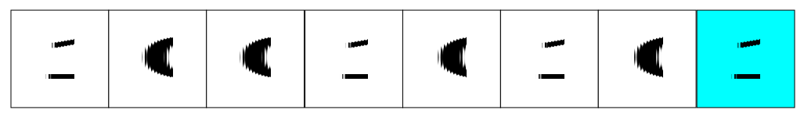

### 데이터의 종류 (Data Types)

- 컴퓨터 레지스터에서 쓰이는 데이터 종류
  - 산술 연산용 숫자(Numeric)
  - 데이터 처리용 영문자(Alpha)
  - 특수 목적용 기호(Special)

- 진수와 진법
  - radix : 진법의 기수에 해당(10,2,8,16,...)

- 영숫자(AlphaNumerric)의 표시
  - ASCII Code : 7bit (+1 parity bit)
    - 'A' = 100 0001
    - 'B' = 100 0002

  - EBCDIC Code: 16bits, IBM interenal code
  - UniCode: 16bits/ 32bits

- Special Communication Data
  - Morse Code
  - Flag signal

### 보수 (Complements)

- 진법의 기수 r에 대응하는 역의 값
- 뺄셈, 논리 계산에 사용

#### (r-1)의 보수 체계

- 9's complement 99999 - 12389 = 87610
- 1's complement 1111111 - 0001111 = 1110000

#### (r)의 보수 체계

- 10's complement 100000 - 12389 = 87611
- 2's complement 10000000 - 0001111 = 1110001

#### 부호 없는 숫자의 뺄셈

- 72532 -13250
  - 10's complement
  - 72532 + 86750 = 159282
  - 159282 -100000 = 59282

### 고정 소수점 표현 (Fixed Point Representation)

- 소수점의 위치를 결정하여 숫자 표현
- 레지스터 비트에 소수점 위치를 표시

- LSB(least significant bit) : 최 우측 비트
  - 이진정수에서 짝수인지 홀수인지를 결정하는 비트 위치
  - 16bit 정수의 경우 LSB에 소수점 자리 위치
- MSB(most significant bit): 최 좌측 비트
  - 이진정수에서 부호(+,-)를 결정하는 비트 위치

#### 정수의 표현

- MSB로 부호 표현
- 양수는 0, 음수는1
- 부호화된 1의 보수 == 1 1110001
- 부호화된 2의 보수 == 1 1110010 

#### 오버플로우(Overflow)의 발생

- N자리 두 수를 더하여 N+1자리의 합이 발생하였을 때
- 가수, 피가수의 부호와 관계없이 발생
- 정해진 레지스터의 비트수로 인한 문제

#### 오버플로우 발생 상황

- 연산 결과값이 레지스터의 비트수를 초과할 경우 발생
- 두 수의 부호가 같을 경우에만 발생
- 레지스터에 저장된 연산 결과값은 잘못된 값으로 저장

#### 오버플로우 처리 방법

- 오버플로우 발생을 미리 확인
  - MSB의 두 캐리 비트의 값이 서로 다르면 오버플로우
  - 연산을 처리하지 않고 인터럽트 or 에러 처리

### 부동 소수점 표현 (Floating Point Representation)

#### 표시 방법(IEEE 754)

- 가수와 지수로 표현
- 가수(mantissa):분수(Fraction), 정수값 표시
- 지수(Component): 십진/이진 소수점 위치를 표시

#### 정규화(Normalization)

| 종류/bit의 구성                 | Signed bit 수 | Exponent bit 수 | Significand 수 |
| ------------------------------- | ------------- | --------------- | -------------- |
| 64bit = double,double precision | 1             | 11              | 52             |
| 32bit = float, single precision | 1             | 8               | 23             |
| 16bit = half, half precision    | 1             | 5               | 10             |

- 부동소수점 숫자에서 최상위 비트가 0이 아닌 경우
- 0이 있을 경우, Mantissa의 소수점 위치 이동
- 이동한 만큼 exponent값 변경

### 기타 이진 코드 (Other Binary Codes)

- Grey Code
  - 한 숫자에서 다음 숫자로 변할 때 한 비트만 변동
  - 제어 계통에 주로 사용
  - 여러 전기 신호가 동시에 바뀔 떄 낮은 에러 발생률

- BCD Code
  - 10진수에 대한 2진수 표현
  - 4bit를 사용(0~9)

- Excess-3 Code
  - BCD Code에 0011(=3)을 더한 형태
  - 암호 교신의 기본 코드, 파생 암호 발생 방법에 사용

- 기타 영문 code
  - ASCII : 7bits + parity 1bit
  - EBCDIC : 8bits + parity 1bit

### 에러 검출 코드 (Error Detection Codes)

#### Parity bit

- 외부 잡음에 의한 에러 발생의 검출
- 짝수(even) & 홀수(odd) 패리티 사용
  - (0101...)2진법에서 1의 개수가 홀수 or 짝수개, 홀수개일 경우 even이 1 odd가 0
- 2개의 비트 동시 에러의 경우 검출 불가

#### Parity bit 적용

- 송신측: 패리티 발생기
- 수신측 : 패리티 검사기
- 수신측에서 패리티 검사 결과 일치하면 에러 없음 (0 출력) // 에러 발생(1 출력)